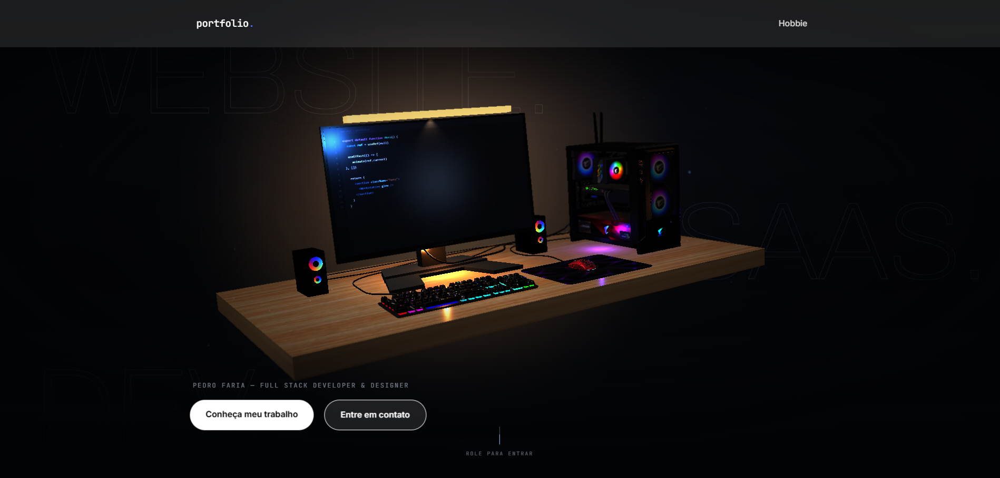
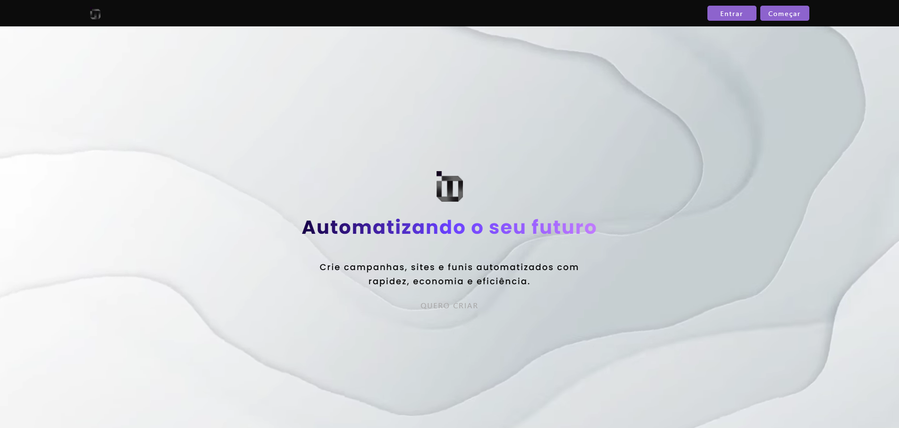
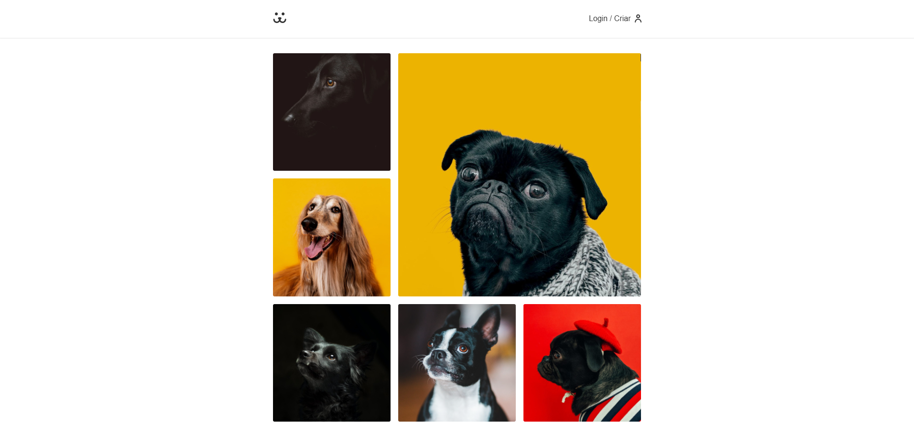

  

    

  
  
  
  
  
  
  

 

## 🧑‍💻 Sobre mim

<table>
  <tr>
    <td width="60%" valign="middle">
      <ul>
        <li>🎓 Estudante de <b>Análise e Desenvolvimento de Sistemas</b></li>
        <li>💻 Foco em desenvolvimento <b>Full Stack</b>, com base sólida em <b>C++</b></li>
        <li>🚀 Curto transformar ideia em produto: do front ao back, do design ao deploy</li>
        <li>🌱 Sempre com um projeto novo rodando pra testar algo diferente</li>
      </ul>
    </td>
    <td width="40%" align="center">
      
    </td>
  </tr>
</table>

 

## 🚀 Projetos em destaque

<table>
  <tr>
    <td width="33%">
      
       
      <h3><a href="https://github.com/pedrohkf/Portifolio">Portfólio</a></h3>
      
Meu site pessoal, feito em Next.js, pra centralizar projetos, contato e apresentação profissional.

      
      
    </td>
    <td width="33%">
      
       
      <h3><a href="https://github.com/pedrohkf/BIT-AI">BIT-AI</a></h3>
      
Plataforma open source de marketing, full stack (front-end + back-end), com deploy contínuo na Vercel.

      
      
        
      
    </td>
    <td width="33%">
      
       
      <h3><a href="https://github.com/pedrohkf/Instagram-Dogs">Instagram Dogs</a></h3>
      
Clone de Instagram para pets, feito em React + Vite, consumindo APIs externas para feed e imagens.

      
      
    </td>
  </tr>
</table>

  
  &nbsp;
  Base sólida em lógica e estruturas — organizada em módulos de aula (aula01 → aula05)

 

## 🛠️ Stack

  <b>FRONT-END</b>
   
  

    

  <b>BACK-END</b>
   
  

    

  <b>FUNDAMENTOS & GAME DEV</b>
   
  

    

  <b>FERRAMENTAS & DESIGN</b>
   
  

 

## 📊 Estatísticas

  

    

  
  

    

  

 

